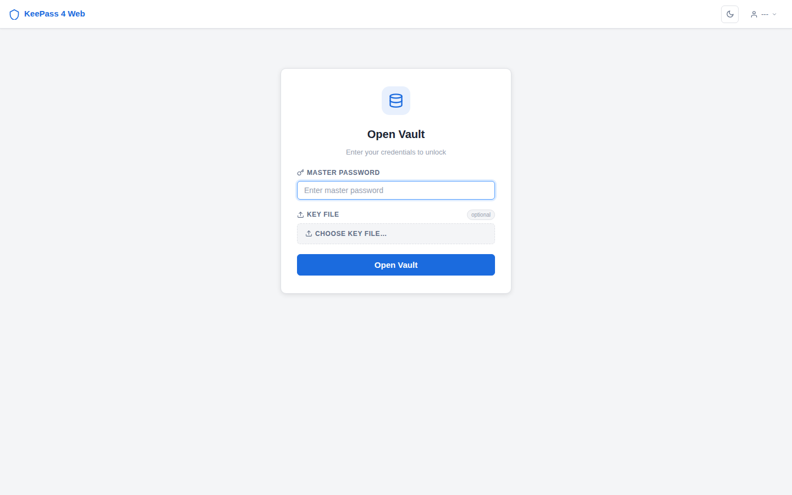
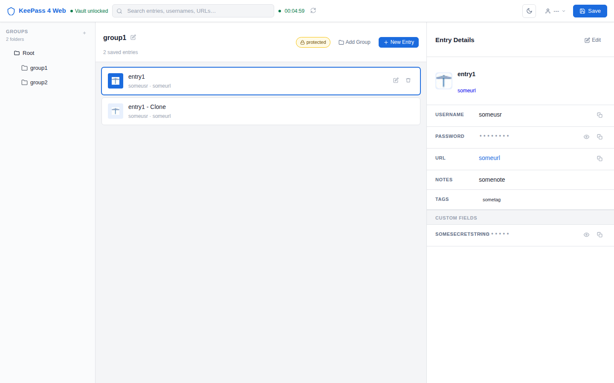
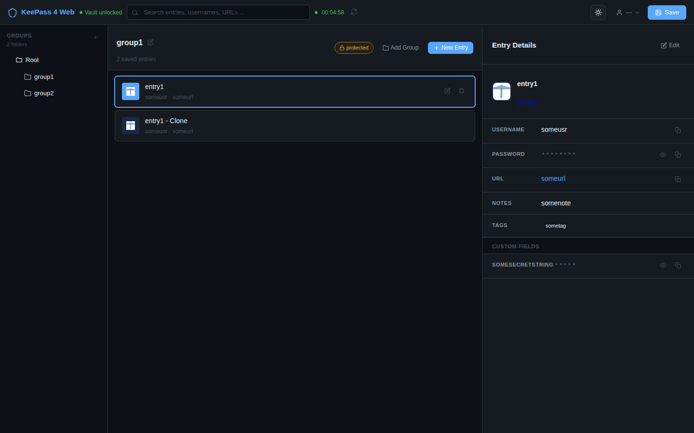
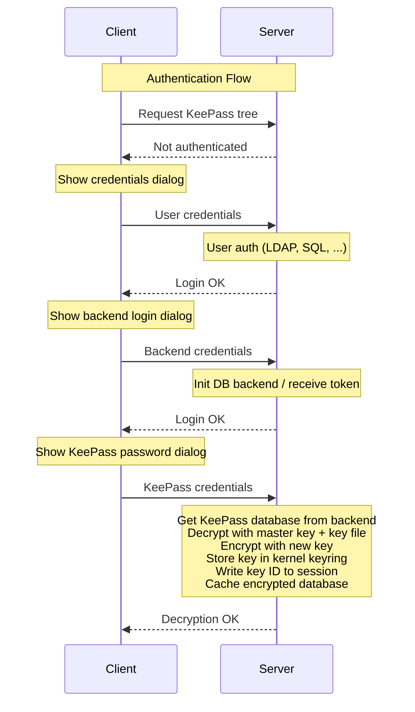
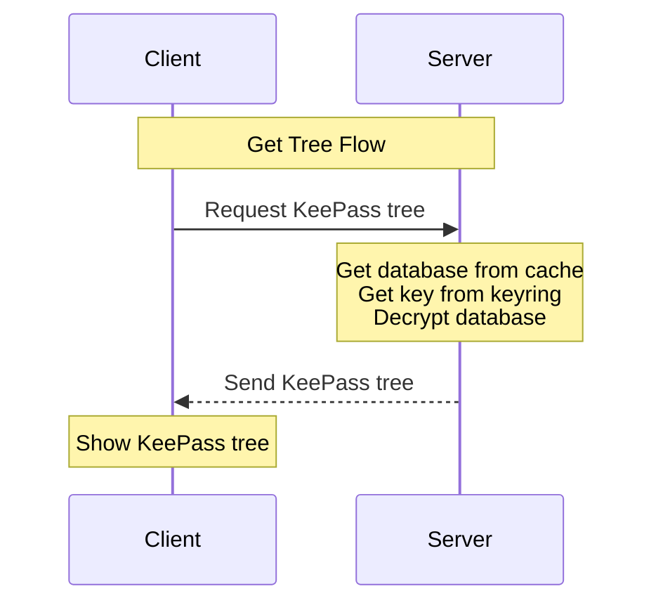
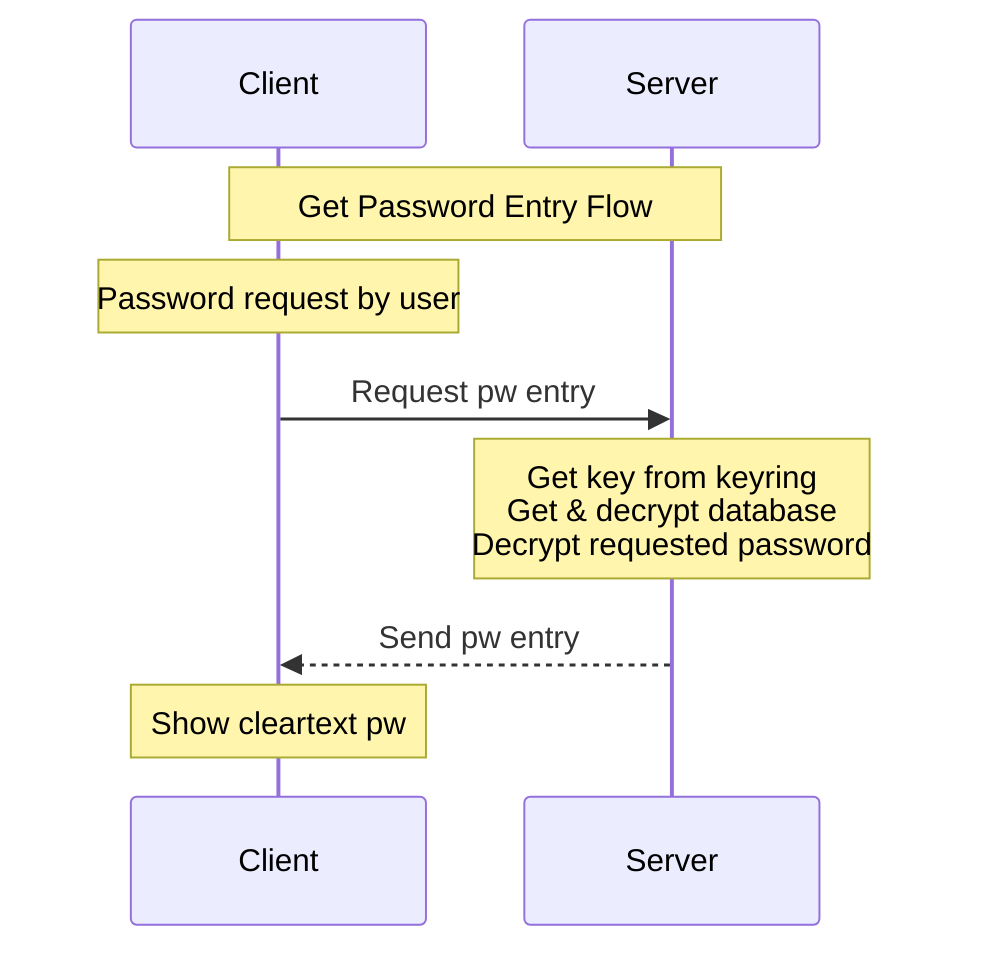

<!-- START doctoc generated TOC please keep comment here to allow auto update -->
<!-- DON'T EDIT THIS SECTION, INSTEAD RE-RUN doctoc TO UPDATE -->
**Table of Contents**  *generated with [DocToc](https://github.com/thlorenz/doctoc)*

- [KeePass4Web](#keepass4web)
  - [FEATURES](#features)
  - [INSTALL](#install)
  - [BUILD FRONTEND](#build-frontend)
  - [CONFIGURATION](#configuration)
  - [DEPLOYMENT](#deployment)
    - [Container](#container)
    - [Docker Compose](#docker-compose)
      - [Which file holds what](#which-file-holds-what)
      - [LDAP, against the bundled OpenLDAP](#ldap-against-the-bundled-openldap)
      - [OIDC, against the bundled Keycloak](#oidc-against-the-bundled-keycloak)
    - [TLS](#tls)
    - [Classic](#classic)
  - [BACKENDS](#backends)
    - [Authentication Backends](#authentication-backends)
    - [Database Backends](#database-backends)
  - [AUDIT TRAIL](#audit-trail)
  - [MISC](#misc)
  - [LIMITATIONS](#limitations)
  - [APP DETAILS / BACKGROUND](#app-details--background)
    - [Sequence of client/server operations](#sequence-of-clientserver-operations)
  - [COPYRIGHT AND LICENSING](#copyright-and-licensing)

<!-- END doctoc generated TOC please keep comment here to allow auto update -->

# KeePass4Web

A mobile-friendly web application that serves KeePass database on a web frontend.

Written in Rust and JavaScript.

## FEATURES

- Doesn't save master password/keyfile, uses a new and unique encryption key to cache the database
- Encryption key is stored securely in the kernel keyring
- Server revokes encryption keys after a configurable user idle time, effectively removing access to the cached database
- Web interface offers entry search and access to files stored inside the database. Also displays custom entry icons







## INSTALL

- From container image:
  See [DEPLOYMENT](#deployment)

- From source:
    - Clone the repo to some dir
      > git clone https://github.com/lixmal/keepass4web-rs.git

      > cd keepass4web-rs

    - Follow [BUILD FRONTEND](#build-frontend), [DEPLOYMENT](#deployment) in that order

## BUILD FRONTEND

The minified, bundled file will be written to public/scripts/bundle.js

- Install Node/npm, e.g. for Ubuntu
  > sudo apt-get install npm

- Install js modules
  > npm install

- Build js bundle
  > npm run build

- For an unminified version you can run
  > npm run dev

## CONFIGURATION

`config.yml` is the configuration the app starts with, and the container ships it at `/conf/config.yml`.
It is deliberately short: the filesystem database backend, no authentication backend, and the general
settings every deployment needs.

[config.example.yml](config.example.yml) is the reference. It documents every option and carries
ready-to-paste blocks for each authentication backend, filled in with values that match the optional
test services in [docker-compose.yml](docker-compose.yml), so a backend can be tried without inventing
any settings first.

Two options are worth knowing about before deploying:

- `use_keyring` — set it to `false` where the kernel keyring is unavailable, which includes Docker
  Desktop on macOS and Windows, whose default seccomp profile blocks the `keyctl`, `add_key` and
  `request_key` syscalls. See [Container](#container) for what is given up.
- `trust_proxy_headers` — leave it `false` unless the app sits behind a reverse proxy that you control
  and that sets `Forwarded` or `X-Forwarded-For`. It decides whether those headers are believed when
  the client address is worked out for login rate limiting; anyone can send them otherwise, and the
  rate limit is then trivially evaded.

Editing `config.yml` means changing the keys that are already in it. Appending a second `auth_backend:`
or `cookie_samesite:` line rather than editing the existing one makes the file invalid and the app
refuses to start with `duplicate field`.

Any setting can be given as an environment variable instead, for deployments that keep the
configuration and the secrets apart. Prefix the name of the setting with `KEEPASS4WEB_`, and step into
a section with two underscores — one underscore is part of a name, two are a level:

```bash
KEEPASS4WEB_PORT=8080
KEEPASS4WEB_DB_SESSION_TIMEOUT='45 minutes'
KEEPASS4WEB_AUTH_BACKEND=LDAP
KEEPASS4WEB_LDAP__BASE_DN='ou=users,dc=example,dc=org'
KEEPASS4WEB_LDAP__PASSWORD='...'
KEEPASS4WEB_SEARCH__FIELDS='[title, username, url]'
```

A variable replaces whatever the file said, and the file is optional: with no `config.yml` present and
no `--config` given, the environment and the built-in defaults are the whole configuration. Asking for
a file that is not there is still an error.

Values are taken literally, so a secret of `12345`, `yes` or `[redacted]` stays that text rather than
being read as a number, a boolean or a list. The settings that are lists accept either the YAML form
or the items separated by commas:

```bash
KEEPASS4WEB_SEARCH__FIELDS='[title, username, url]'
KEEPASS4WEB_SEARCH__FIELDS='title, username, url'
KEEPASS4WEB_OIDC__SCOPES='profile'
```

## DEPLOYMENT

### Container

See [GitHub Packages](https://ghcr.io/lixmal/keepass4web-rs)

The image ships with the default config in `/conf/config.yml`, which should be overwritten with a mount/volume.

The app makes use of the [Linux kernel keyring](https://man7.org/linux/man-pages/man7/keyrings.7.html).

The keyring is currently not namespaced, hence container tooling deactivate the specific syscalls by default.
To make the app run you will need to activate the syscalls by creating a custom seccomp profile and passing the path to
the container runtime:

- [Docker](https://docs.docker.com/engine/security/seccomp/)
- [podman](https://docs.podman.io/en/v4.6.0/markdown/options/seccomp-policy.html)

A base file for extension can be found [here](https://github.com/moby/moby/blob/master/profiles/seccomp/default.json),
see the `syscalls` section.

The required syscalls are:

- keyctl
- add_key
- request_key

There's an example seccomp profile [seccomp/keyring.json](seccomp/keyring.json) in the repo.

**Make sure no other containers are running under the same user, or they will be able to access keys stored for
keepass4web**.

This is best achieved by running rootless containers with a dedicated user for keepass4web.

- [Docker](https://docs.docker.com/engine/security/rootless/)
- [podman](https://github.com/containers/podman/blob/main/docs/tutorials/rootless_tutorial.md)

Where a seccomp profile is not an option, `use_keyring: false` falls back to keeping the keys in the process memory of
the app instead of the kernel keyring. That is weaker: the pages are not locked, so a key can reach swap or a core dump,
and it is logged as a warning on startup. Prefer the seccomp profile above where you can.

Example docker:

    docker run \
      -p 8080:8080 -v ./config.yml:/conf/config.yml \
      -v ./tests/test.kdbx:/db.kdbx \
      --security-opt seccomp=seccomp/keyring.json \
      ghcr.io/lixmal/keepass4web-rs:main

Example podman:

    podman run \
      --userns=keep-id \
      -p 8080:8080 -v ./config.yml:/conf/config.yml \
      -v ./tests/test.kdbx:/db.kdbx \
      --security-opt seccomp=seccomp/keyring.json \
      ghcr.io/lixmal/keepass4web-rs:main

(master password: `test`)


### Docker Compose

[docker-compose.yml](docker-compose.yml) starts the app on its own, and carries two optional services —
OpenLDAP and Keycloak — for trying the LDAP and OIDC backends without standing anything up yourself.
Both are commented out.

Ports, credentials and the Keycloak URL come from the environment rather than being written into the
compose file. [.env.example](.env.example) holds throwaway values for local testing:

```bash
cp .env.example .env      # docker compose picks .env up automatically
```

To start the app by itself:

```bash
docker compose up -d
```

It listens on `${APP_PORT}` (8080 by default), and the bundled `tests/test.kdbx` opens with the master
password `test`. To stop it:

```bash
docker compose down
```

Enabling one of the auth services is three steps: copy `.env.example` as above, uncomment the service
block you want in `docker-compose.yml`, and point `config.yml` at it. The two sections below do the
last step; the compose file repeats the same settings next to each service.

#### Which file holds what

Two files are involved, because two programs are being configured. `.env` sets up the test service —
what OpenLDAP is seeded with, which ports are published, which URL Keycloak announces itself on.
`config.yml` tells the app how to talk to it. Neither is optional for the test services, and
`config.yml` does no variable expansion, so where the two overlap the value has to be written out in
both by hand:

| `.env`                                    | sets                                | copy into `config.yml` as                       |
|-------------------------------------------|-------------------------------------|-------------------------------------------------|
| `APP_PORT`                                | port the app is published on        | —                                               |
| `LDAP_ROOT`                               | root of the directory tree          | part of `base_dn` and `bind`                    |
| `LDAP_ADMIN_USERNAME` / `LDAP_ADMIN_PASSWORD` | the directory administrator     | `bind` and `password`                           |
| `LDAP_TEST_USER` / `LDAP_TEST_PASSWORD`   | a user to log in as                 | — (typed at the login form)                     |
| `LDAP_PORT`                               | published LDAP port                 | `uri`, only outside compose                     |
| `KC_PUBLIC_URL`                           | Keycloak's `--hostname`             | the host part of `issuer`                       |
| `KC_PORT`                                 | published Keycloak port             | — (keep it equal to the port in `KC_PUBLIC_URL`)|
| `OIDC_REALM`                              | realm imported from `realm.json`    | the realm in `issuer` and `discovery_url`       |
| `OIDC_CLIENT_ID` / `OIDC_CLIENT_SECRET`   | the client in `realm.json`          | `client_id` and `client_secret`                 |
| `KC_ADMIN_USERNAME` / `KC_ADMIN_PASSWORD` | admin console login                 | — (the app never uses it)                       |

Two of these do not follow the variable. `OIDC_REALM`, `OIDC_CLIENT_ID` and `OIDC_CLIENT_SECRET`
describe what [tests/keycloak/realm.json](tests/keycloak/realm.json) already contains rather than
setting it, and the client's redirect URI in that file is fixed at port 8080; changing either means
editing the realm file too.

For a real deployment none of this applies — there is no `.env`, and `config.yml` is the only file,
with [config.example.yml](config.example.yml) as the reference for it.

#### LDAP, against the bundled OpenLDAP

Uncomment the `openldap` block in `docker-compose.yml`. It is seeded with the user from `.env`
(`LDAP_TEST_USER` / `LDAP_TEST_PASSWORD`, `testuser` / `testpass` by default).

In `config.yml`, change the existing `auth_backend` line and add the `LDAP` block:

```yaml
auth_backend: 'LDAP'

LDAP:
  uri: 'ldap://openldap:1389'
  scope: 'subtree'
  base_dn: 'ou=users,dc=example,dc=org'
  filter: '(objectClass=inetOrgPerson)'
  login_attribute: 'uid'
  bind: 'cn=admin,dc=example,dc=org'
  password: 'adminpassword'
```

Then `docker compose up -d` and log in as `testuser`. Running the app outside compose, the server is
reachable on the host instead: `ldap://127.0.0.1:${LDAP_PORT}`.

`base_dn`, `bind` and `password` follow `LDAP_ROOT`, `LDAP_ADMIN_USERNAME` and `LDAP_ADMIN_PASSWORD`
from `.env`; change them there and these three have to match.

To let only some of the directory in, put a group check in `filter` — it is combined with the login
attribute match, so a user has to satisfy both:

```yaml
  filter: '(&(objectClass=inetOrgPerson)(memberOf=cn=keepass,ou=groups,dc=example,dc=org))'
```

That is as far as it goes: the filter decides who may log in, and everyone who does gets the same
access. There are no roles and no administrators — nothing distinguishes one logged-in user from
another. What can differ per user is the database they are handed: `database_attribute` and
`keyfile_attribute` read the location from an attribute on the user's own entry, so members of the
same group can still be pointed at separate databases.

Active Directory, per-user database locations and the remaining options are covered in
[config.example.yml](config.example.yml).

#### OIDC, against the bundled Keycloak

Uncomment the `keycloak` block. The `keepass` realm is imported on startup from
[tests/keycloak/realm.json](tests/keycloak/realm.json): a confidential client `keepass4web`, the
redirect URI `http://localhost:8080/callback_user_auth`, and the user `testuser` / `testpass`. That
URI is baked into the realm file rather than read from the environment, so raising `APP_PORT` means
editing it there too, or Keycloak rejects the login.
The admin console is at `${KC_PUBLIC_URL}` with `KC_ADMIN_USERNAME` / `KC_ADMIN_PASSWORD`.

The browser and the app reach Keycloak at two different addresses — the browser at `${KC_PUBLIC_URL}`,
the app at the compose service name — so both are configured:

```yaml
auth_backend: 'OIDC'

# the redirect flow needs the session cookie to survive the return trip
cookie_samesite: 'lax'

OIDC:
  # what the browser is sent to, and what tokens are trusted against
  issuer: 'http://localhost:8081/realms/keepass'
  # where the app reads the metadata, over the compose network
  discovery_url: 'http://keycloak:8080/realms/keepass/.well-known/openid-configuration'
  client_id: 'keepass4web'
  client_secret: 'insecure-example-client-secret'
  save_id_token: true
  scopes:
    - 'profile'
```

`auth_backend` and `cookie_samesite` already exist in `config.yml` — change those lines rather than
adding second ones.

Keycloak is started with `--hostname=${KC_PUBLIC_URL}` so it names the same issuer no matter which
address it was asked on. The app fetches the document over the internal address and points the
endpoints it calls itself — token, JWKS, userinfo — back at that internal address, while leaving the
ones the browser is redirected to on the public URL. Without `discovery_url` the app would advertise
the compose service name to the browser, which cannot resolve it.

Give Keycloak half a minute on the first start, then open `http://localhost:${APP_PORT}` and log in as
`testuser`.

Running the app outside compose, drop `discovery_url` altogether: the browser and the app then share
`${KC_PUBLIC_URL}` and there is nothing to split.

### TLS

The app speaks plain HTTP and has no TLS listener: `listen` and `port` are handed straight to the
server, and there is nowhere to give it a certificate. Anything reachable beyond localhost belongs
behind a reverse proxy that terminates TLS, because the master password and the entries themselves
cross that connection.

Two settings follow from that:

- `cookie_samesite` — the session cookie is not marked `Secure` by the app, so the proxy is what keeps
  it off plaintext. `strict` is the default; a redirecting auth backend such as OIDC needs `lax`, since
  the cookie has to survive the return trip from the provider.
- `trust_proxy_headers` — off by default, and it should stay off until the proxy is in place. It
  decides whether `Forwarded` and `X-Forwarded-For` are believed when the client address is determined
  for login rate limiting. Without a proxy every request appears to come from the proxy's address and
  one attacker's failures would rate limit everyone; with it enabled and no proxy, anyone can spoof the
  header and never be rate limited at all.

Connections the app makes outwards are TLS-verified and cannot be told to skip verification:

- LDAP over `ldaps://`, and `ldapi://` for a local socket, are accepted alongside `ldap://`. Certificates
  are checked against the system trust store, so a private CA has to be installed in the image or the
  host the app runs on.
- OIDC and the HTTP database backend verify against a **bundled** root store rather than the system one.
  A certificate signed by a private or corporate CA is rejected there even when that CA is trusted by
  the host, so an internal provider needs a publicly trusted certificate, or the connection to it has to
  stay inside a network you trust.

The bundled Keycloak and OpenLDAP services are plain HTTP and LDAP. They exist to exercise the login
flows on a laptop, not to model a deployment.

### Classic

This requires rust installed, compile the binary:

    cargo build --bins --release

Run the binary:

    target/release/keepass4web-rs

On x86 the key derivation and the database crypto are noticeably faster with AES-NI and SSE, which are
not in the default baseline. The flags only exist on that architecture, so set them there and nowhere
else — on aarch64 they fail the build:

    export RUSTFLAGS="-Ctarget-cpu=sandybridge -Ctarget-feature=+aes,+sse2,+sse4.1,+ssse3"

The container image does the same thing per target triple, so its published amd64 build carries them
and the arm64 one does not.

## BACKENDS

### Authentication Backends

* **Htpasswd**
    * Authenticates users against a `.htpasswd` file.

* **LDAP**
    * Authenticates against external LDAP servers (Microsoft AD, OpenLDAP, etc.)
    * Provides customizable search filters, attribute mapping, and secure binding.

* **OIDC**
    * Authenticates users with a compatible OpenID Connect provider.
    * Retrieves user information, supports customizable scopes, CSRF protection, and logout functionality.

### Database Backends

* **Filesystem**
    * Retrieves KeePass databases from the local filesystem.
    * Can fetch database and keyfile locations from authentication backend or configuration.

* **HTTP**
    * Fetches KeePass databases over HTTP/HTTPS.
    * Supports basic authentication and bearer token mechanisms.

## AUDIT TRAIL

What was done to the vault is recorded under its own log target, so it can be kept and routed separately
from the ordinary application log:

```bash
RUST_LOG=warn,audit=info
```

```text
[2026-08-29T10:23:23Z INFO  audit] user="alice" action=db.opened
[2026-08-29T10:23:23Z INFO  audit] user="alice" action=entry.revealed id=2930242f-… field=Password
[2026-08-29T10:23:23Z INFO  audit] user="alice" action=entry.revealed id=2930242f-… field=custom
[2026-08-29T10:23:25Z INFO  audit] user="alice" action=db.saved
```

Recorded: the database being opened, closed and saved; a protected field being read; an attachment being
downloaded; and entries and groups being created, changed, deleted or moved.

**The trail never contains anything from inside the database.** No field values, and no names either:
not entry titles, not group names, not attachment filenames. A record that held those would be a copy of
the vault kept in a file that lives longer and is guarded less. Entries and groups are named by their
identifier, and turning one back into an entry needs the database, which needs the master password.

Field names are the one exception, and only the five the format defines (`Title`, `UserName`,
`Password`, `URL`, `Notes`): those are not written by anyone. A custom field is named by whoever added
it, closely enough to describe the secret it holds, so it is recorded as `custom`.

## MISC

- Show kernel keyrings in use (as root)
  > sudo cat /proc/keys

  > sudo cat /proc/key-users

## LIMITATIONS

- KeePass databases are read-only
- Limits of kernel keyring apply

## APP DETAILS / BACKGROUND

### Sequence of client/server operations


```mermaid
sequenceDiagram
    participant C as Client
    participant S as Server

    Note over C,S: Authentication Flow
    C->>S: Request KeePass tree
    S-->>C: Not authenticated
    Note over C: Show credentials dialog
    C->>S: User credentials
    Note over S: User auth (LDAP, SQL, ...)
    S-->>C: Login OK
    Note over C: Show backend login dialog
    C->>S: Backend credentials
    Note over S: Init DB backend / receive token
    S-->>C: Login OK
    Note over C: Show KeePass password dialog
    C->>S: KeePass credentials
    Note over S: Get KeePass database from backend<br/>Decrypt with master key + key file<br/>Encrypt with new key<br/>Store key in kernel keyring<br/>Write key ID to session<br/>Cache encrypted database
    S-->>C: Decryption OK
```


```mermaid
sequenceDiagram
    participant C as Client
    participant S as Server

    Note over C,S: Get Tree Flow
    C->>S: Request KeePass tree
    Note over S: Get database from cache<br/>Get key from keyring<br/>Decrypt database
    S-->>C: Send KeePass tree
    Note over C: Show KeePass tree
```


```mermaid
sequenceDiagram
    participant C as Client
    participant S as Server

    Note over C,S: Get Password Entry Flow
    Note over C: Password request by user
    C->>S: Request pw entry
    Note over S: Get key from keyring<br/>Get & decrypt database<br/>Decrypt requested password
    S-->>C: Send pw entry
    Note over C: Show cleartext pw
```


## COPYRIGHT AND LICENSING

This software is copyright (c) by Viktor Liu.
It is released under the terms of the GPL version 3.

Most of the icons in the `public/img/icons` directory are released under the LGPL version 2, the licence can be found in
the same directory.
The remaining icons are public domain.
As these icons are the same as the ones used by the original KeePass software, you can refer to the info
there: [Icon Acknowledgements](http://keepass.info/help/base/credits.html#icons).
