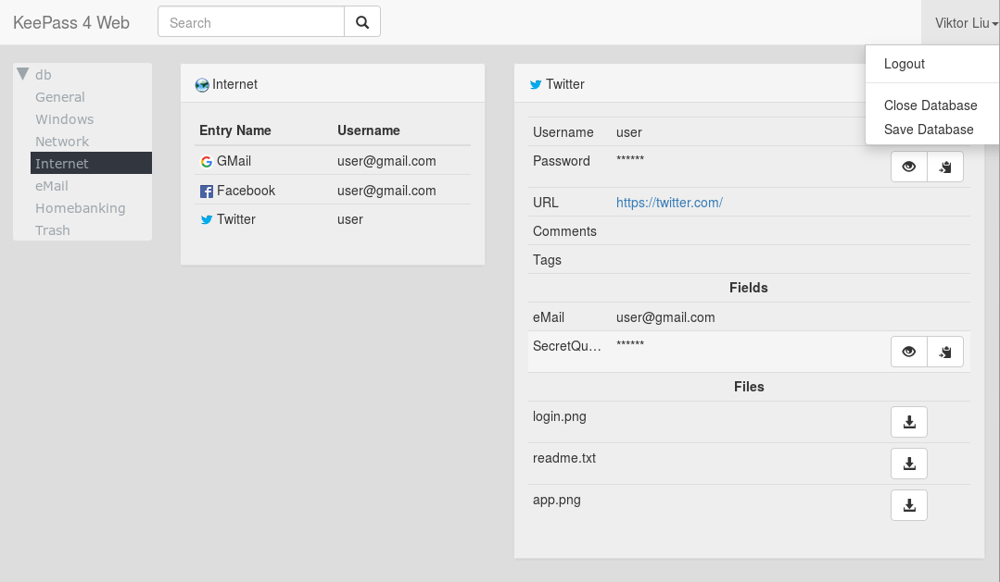

<!-- START doctoc generated TOC please keep comment here to allow auto update -->
<!-- DON'T EDIT THIS SECTION, INSTEAD RE-RUN doctoc TO UPDATE -->
**Table of Contents**  *generated with [DocToc](https://github.com/thlorenz/doctoc)*

- [KeePass4Web](#keepass4web)
  - [FEATURES](#features)
  - [INSTALL](#install)
  - [BUILD FRONTEND](#build-frontend)
  - [CONFIGURATION](#configuration)
  - [DEPLOYMENT](#deployment)
    - [Container](#container)
    - [Classic](#classic)
  - [BACKENDS](#backends)
    - [Authentication Backends](#authentication-backends)
    - [Database Backends](#database-backends)
  - [MISC](#misc)
  - [LIMITATIONS](#limitations)
  - [APP DETAILS / BACKGROUND](#app-details--background)
    - [Sequence of client/server operations](#sequence-of-clientserver-operations)
  - [COPYRIGHT AND LICENSING](#copyright-and-licensing)

<!-- END doctoc generated TOC please keep comment here to allow auto update -->

# KeePass4Web

A mobile-friendly web application that serves KeePass database on a web frontend.

Written in Rust and JavaScript.

## FEATURES

- Doesn't save master password/keyfile, uses a new and unique encryption key to cache the database
- Encryption key is stored securely in the kernel keyring
- Server revokes encryption keys after a configurable user idle time, effectively removing access to the cached database
- Web interface offers entry search and access to files stored inside the database. Also displays custom entry icons




## INSTALL

- From container image:
  See [DEPLOYMENT](#deployment)

- From source:
    - Clone the repo to some dir
      > git clone https://github.com/lixmal/keepass4web-rs.git

      > cd keepass4web-rs

    - Follow [BUILD FRONTEND](#build-frontend), [DEPLOYMENT](#deployment) in that order

## BUILD FRONTEND

The minified, bundled file will be written to public/scripts/bundle.js

- Install Node/npm, e.g. for Ubuntu
  > sudo apt-get install npm

- Install js modules
  > npm install

- Copy bootstrap font files
  > cp node_modules/bootstrap/fonts/* public/fonts/

- Build js bundle
  > npm run build

- For a non-uglified version you can run
  > npm run dev

## CONFIGURATION

- See `config.yml`

## DEPLOYMENT

### Container

See [GitHub Packages](https://ghcr.io/lixmal/keepass4web-rs)

The image ships with the default config in `/conf/config.yml`, which should be overwritten with a mount/volume.

The app makes use of the [Linux kernel keyring](https://man7.org/linux/man-pages/man7/keyrings.7.html).

The keyring is currently not namespaced, hence container tooling deactivate the specific syscalls by default.
To make the app run you will need to activate the syscalls by creating a custom seccomp profile and passing the path to
the container runtime:

- [Docker](https://docs.docker.com/engine/security/seccomp/)
- [podman](https://docs.podman.io/en/v4.6.0/markdown/options/seccomp-policy.html)

A base file for extension can be found [here](https://github.com/moby/moby/blob/master/profiles/seccomp/default.json),
see the `syscalls` section.

The required syscalls are:

- keyctl
- add_key
- request_key

There's an example seccomp profile [seccomp/keyring.json](seccomp/keyring.json) in the repo.

**Make sure no other containers are running under the same user, or they will be able to access keys stored for
keepass4web**.

This is best achieved by running rootless containers with a dedicated user for keepass4web.

- [Docker](https://docs.docker.com/engine/security/rootless/)
- [podman](https://github.com/containers/podman/blob/main/docs/tutorials/rootless_tutorial.md)

Example docker:

    docker run \
      -p 8080:8080 -v ./config.yml:/conf/config.yml \
      -v ./tests/test.kdbx:/db.kdbx \
      --security-opt seccomp=seccomp/keyring.json \
      ghcr.io/lixmal/keepass4web-rs:master

Example podman:

    podman run \
      --userns=keep-id \
      -p 8080:8080 -v ./config.yml:/conf/config.yml \
      -v ./tests/test.kdbx:/db.kdbx \
      --security-opt seccomp=seccomp/keyring.json \
      ghcr.io/lixmal/keepass4web-rs:master

(master password: `test`)


### Docker Compose

For easier deployment, you can use Docker Compose file

Then, to start the container run:


```
docker-compose up -d

```

To stop the container:

```
docker-compose down
```

### Classic

This requires rust installed, compile the binary:

    export RUSTFLAGS="-Ctarget-cpu=sandybridge -Ctarget-feature=+aes,+sse2,+sse4.1,+ssse3"
    cargo build --bins --release --target-dir release

Run the binary:

    target/release/keepass4web-rs

## BACKENDS

### Authentication Backends

* **Htpasswd**
    * Authenticates users against a `.htpasswd` file.

* **LDAP**
    * Authenticates against external LDAP servers (Microsoft AD, OpenLDAP, etc.)
    * Provides customizable search filters, attribute mapping, and secure binding.

* **OIDC**
    * Authenticates users with a compatible OpenID Connect provider.
    * Retrieves user information, supports customizable scopes, CSRF protection, and logout functionality.

### Database Backends

* **Filesystem**
    * Retrieves KeePass databases from the local filesystem.
    * Can fetch database and keyfile locations from authentication backend or configuration.

* **HTTP**
    * Fetches KeePass databases over HTTP/HTTPS.
    * Supports basic authentication and bearer token mechanisms.

## MISC

- Show kernel keyrings in use (as root)
  > sudo cat /proc/keys

  > sudo cat /proc/key-users

## LIMITATIONS

- KeePass databases are read-only
- Limits of kernel keyring apply

## APP DETAILS / BACKGROUND

### Sequence of client/server operations


## COPYRIGHT AND LICENSING

This software is copyright (c) by Viktor Liu.
It is released under the terms of the GPL version 3.

Most of the icons in the `public/img/icons` directory are released under the LGPL version 2, the licence can be found in
the same directory.
The remaining icons are public domain.
As these icons are the same as the ones used by the original KeePass software, you can refer to the info
there: [Icon Acknowledgements](http://keepass.info/help/base/credits.html#icons).
